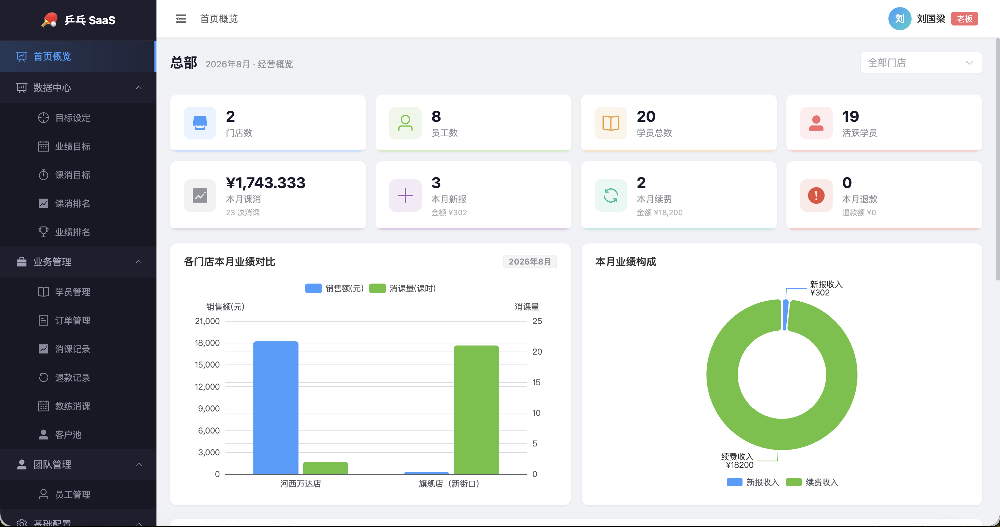
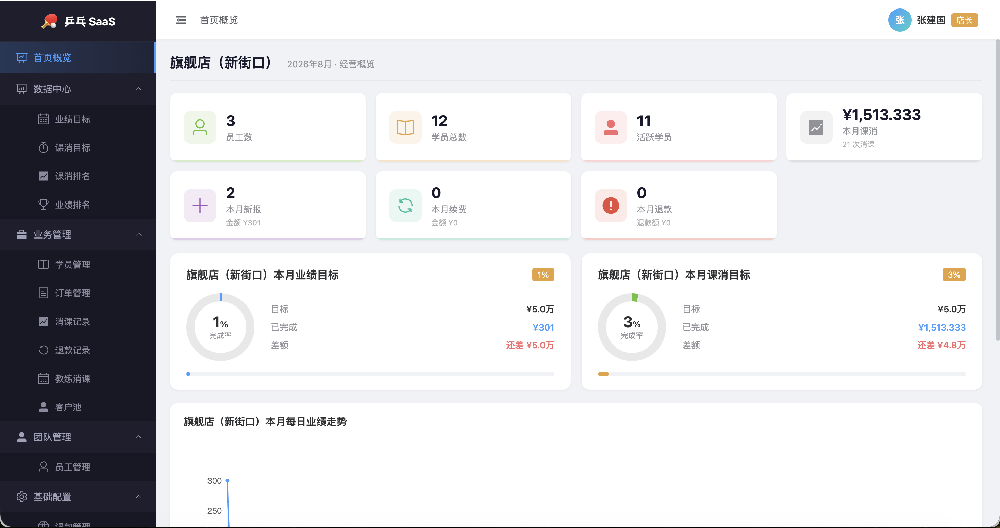

# pingpong-saas-springboot

乒乓球培训连锁机构的多门店 SaaS 管理系统后端。

## 截图

老板视角看板：



店长视角看板：



## 技术栈

Spring Boot 3.3.5 / MyBatis-Plus 3.5.7 / MySQL 8.0 / JWT 认证 / Maven / Java 21

依赖：Lombok / Hutool / jjwt / mysql-connector-j

## 快速开始

```bash
# 1. 克隆
git clone https://github.com/xiaoshun12138/pingpong-saas-springboot.git
cd pingpong-saas-springboot

# 2. 创建数据库并导入
mysql -u root -p -e "CREATE DATABASE pingpong_saas DEFAULT CHARACTER SET utf8mb4"
mysql -u root -p pingpong_saas < sql/pingpong_saas_dump.sql

# 3. 修改 src/main/resources/application.yml 中的数据库密码

# 4. 启动
mvn compile && mvn spring-boot:run
```

访问 `http://localhost:8080`，前端页面已打包在 static 目录。

### 测试账号

| 角色 | 手机号 | 密码 |
|------|--------|------|
| 老板 | 13800000001 | 123456 |
| 店长 | 13800000002 | 123456 |

教练(13800000003)和销售(13800000004)不能登录后台，仅供小程序端使用。

## 业务模型

系统管理乒乓球培训班的日常运营，核心概念：

- **门店**：连锁培训机构有多个门店，数据按门店隔离
- **员工**：老板、店长、教练、销售四种角色，店长归属固定门店
- **学员**：每个学员归属一个门店和一个主管教练，记录剩余课时
- **课包**：体验卡、月卡、季卡、年卡等不同套餐，定义总课时和价格
- **订单**：学员购买课包的记录，区分新报和续费，跟踪剩余/已消课时
- **消课**：学员每上一节课消 1 课时，关联教练和订单
- **退款**：支持订单全额退款，退款金额由后端按比例计算
- **排课**：教练按日排课，保存排课的同时自动消 1 课时，取消排课自动归还
- **目标**：每月/每周可设定各门店的销售额和消课额目标
- **客户池**：按学员缴费/消课数据排名，标记需约课、需续费、已流失的学员

## 数据库

10 张表，全部支持逻辑删除（deleted 字段，MyBatis-Plus @TableLogic 自动处理）：

| 表 | 用途 |
|----|------|
| store | 门店 |
| staff | 员工 |
| student | 学员 |
| course_type | 课包类型 |
| course_order | 课包订单 |
| course_consumption | 消课记录 |
| refund_log | 退款记录 |
| lesson_schedule | 排课记录 |
| monthly_target | 月度目标 |
| weekly_target | 周度目标 |

## API

50+ 个接口，除登录外均需 JWT Token。

| 模块 | 路径前缀 | 主要接口 |
|------|---------|---------|
| 认证 | /api/auth | 登录 |
| 首页看板 | /api/dashboard | 核心指标、每日趋势、门店对比 |
| 排名 | /api/ranking | 教练课消/业绩排名、销售业绩排名、门店排名 |
| 目标看板 | /api/target-dashboard | 业绩目标、课消目标（年度/月度/周度） |
| 目标设定 | /api/monthly-targets, /api/weekly-targets | 目标 CRUD（仅老板） |
| 学员 | /api/students | CRUD、停课/复课、查看课包、排序筛选 |
| 订单 | /api/course-orders | 新报/续费 |
| 消课 | /api/course-consumptions | 消课操作、记录查询 |
| 退款 | /api/refund-logs | 退款操作、记录查询 |
| 排课 | /api/schedules | 排课 CRUD |
| 客户池 | /api/customer-pool | 学员总览、建议约课/续费、流失学员 |
| 课包 | /api/course-types | 课包类型 CRUD |
| 员工 | /api/staff | CRUD、角色筛选 |
| 门店 | /api/stores | CRUD（仅老板） |

## 权限

JWT Token 中携带角色信息，AuthInterceptor 校验后注入 request。Controller 按角色过滤数据：老板看全部、店长看本门店、教练和销售仅小程序端使用。

## 项目结构

```
src/main/java/com/pingpong/
├── PingPongApplication.java     # 启动类
├── common/                       # JWT工具、统一响应、异常处理
├── config/                       # 跨域、MyBatis-Plus插件、拦截器
├── interceptor/                  # JWT认证拦截器
├── runner/                       # 启动时明文密码转BCrypt
├── entity/                       # 10个实体
├── dto/                          # 7个数据传输对象
├── mapper/                       # 10个Mapper接口
├── service/                      # Service接口及实现
├── controller/                   # 15个Controller
└── vo/                           # 视图对象
```

## 环境变量

| 变量 | 说明 | 默认值 |
|------|------|--------|
| DB_PASSWORD | MySQL 密码 | — |
| JWT_SECRET | JWT 签名密钥 | 内置默认值 |
| CORS_ALLOWED_ORIGINS | 允许的前端域名 | * |

## 关联项目

前端：https://github.com/xiaoshun12138/pingpong-saas-vue
